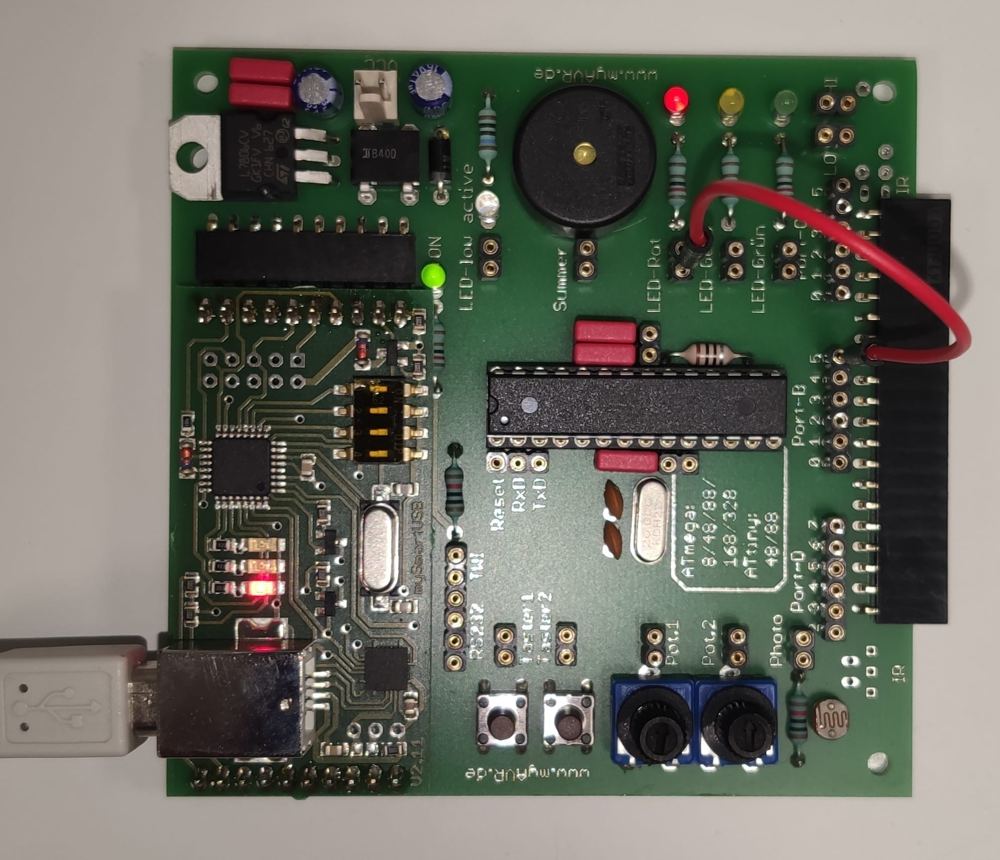

## myAVR Board MK2 2.20

#### Atmega328P  
`avr-gcc` supports the Atmel microcontrollers.
A good portion of ASF (sadly too many modifications needed)   
can be used to develop easier for the ATmega328p


#### Example Blinky
```C++
#include <avr/io.h>
#include <util/delay.h>

int main(void)
{
    // make the LED pin an output for PORTB5
    DDRB = 1 << DDB5;       // DDB5 = 5

    while (1)
    {
        _delay_ms(500);

        // toggle the LED
        PORTB ^= 1 << PB5;  // PB5 = 5
    }

    return 0;
}
```

